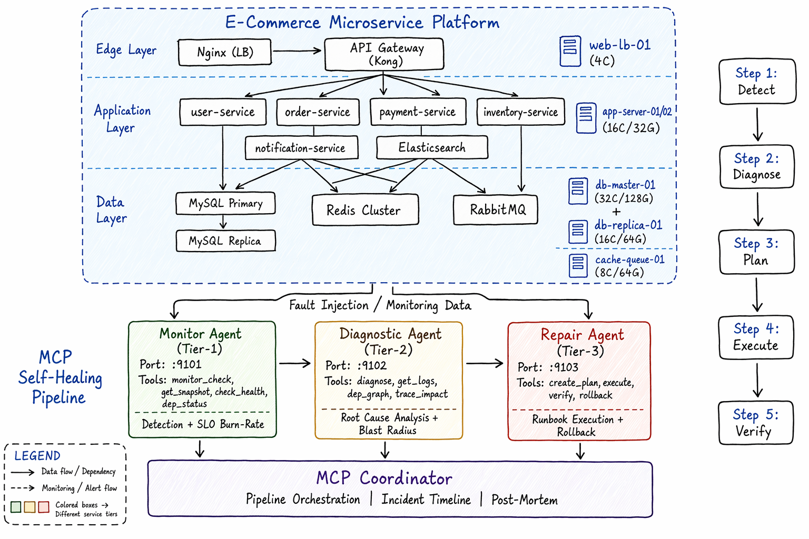

<div align="center">

# Self-Healing Ops v2.0

### Intelligent AIOps Self-Healing System

**MCP Multi-Agent based automated fault detection, diagnosis, and repair platform**

Realistic e-commerce microservice architecture - 8 production-grade fault scenarios - 11 repair actions - End-to-end self-healing

<br>


</div>

---

## Architecture



<details>
<summary><b>Text Version (ASCII)</b></summary>

```
+-------------------------------------------------------------------------+
|                   E-Commerce Microservice Platform                        |
|                                                                          |
|   +----------+    +---------------------------+    +-----------------+  |
|   |  Nginx   |--->|    API Gateway (Kong)      |    |  db-master-01   |  |
|   |  (LB)    |    +---+--------+--------+---+    |  MySQL Primary   |  |
|   +----------+        |        |        |         |  (32C/128G/2TB)  |  |
|                 +-----+--+ +---+---+ +--+----+   +--------+--------+  |
|                 | user-  | |order- | |payment|            |            |
|                 |service | |service| |service|    +-------+--------+  |
|                 +---+----+ +---+---+ +---+---+    |  db-replica-01 |  |
|                     |         |         |         |  MySQL Replica  |  |
|                 +---+---------+---------+---+    +----------------+  |
|                 |    app-server-01/02        |                        |
|                 |    (16C/32G each)          |    +-----------------+  |
|                 +----------------------------+    | cache-queue-01  |  |
|                                                   | Redis + RabbitMQ|  |
|   +------------------+                            | (8C/64G)        |  |
|   | notification-svc | <-- RabbitMQ              +-----------------+  |
|   | inventory-svc    |                                                 |
|   | Elasticsearch    |                                                 |
|   +------------------+                                                 |
+-------------------------------------------------------------------------+
                                 |
                     +-----------+-----------+
                     v           v           v
              +------------+ +---------+ +------------+
              |  Monitor   | | Diag    | |  Repair    |
              |   Agent    | |  Agent  | |   Agent    |
              |  (Max Key) | | (Std 1) | |  (Std 2)   |
              |  :9101     | | :9102   | |  :9103     |
              +------------+ +---------+ +------------+
                     |           |           |
                     +-----------+-----------+
                                 v
                     +-----------------------+
                     |   MCP Coordinator     |
                     |   Pipeline Orchest.   |
                     |   Incident Timeline  |
                     |   Post-Mortem Report |
                     +-----------------------+
```

</details>

## Features

### Realistic Infrastructure
- **6 servers**: LB / App x2 / DB Master / DB Replica / Cache+Queue
- **12 microservices**: Full e-commerce chain (User -> Order -> Payment -> Inventory)
- **17 dependency edges**: gRPC / HTTP / MySQL / Redis / AMQP
- **Service dependency graph** with cascading failure propagation

### SRE Best Practices
- **SLO Burn-Rate**: Google SRE 4-window alerting method
- **Escalation Policy**: P0-P3 graduated auto-remediation
- **Blast Radius**: Real-time fault impact assessment
- **Post-Mortem**: Automatic incident timeline generation

### 3-Agent Collaboration
- **MonitorAgent** (Tier-1): Fast detection, SLO analysis
- **DiagnosticAgent** (Tier-2): Deep diagnosis, root cause localization
- **RepairAgent** (Tier-3): Runbook execution, rollback protection
- **Separate API Keys**: Simulates different service account tiers

### Full Auto Self-Healing
- **11 repair actions**: restart / rollback / scale / index / circuit breaker
- **Per-step verification**: Auto health check after each repair
- **Auto rollback**: Immediate revert on failure
- **Side-effect reporting**: Records impact of every operation

## Quick Start

### Requirements

| Dependency | Version |
|------------|---------|
| Python     | 3.10+   |
| Conda env  | autodev-agent |
| LLM API    | Any Anthropic-compatible API |

### Install and Run

```bash
# 1. Activate environment
conda activate autodev-agent

# 2. Enter project
cd projectidea/self-healing-ops

# 3. Install dependencies
pip install -r requirements.txt

# 4. Configure API Key (required for first run)
cp .env.example .env
# Edit .env file, fill in your API Key:
#   MONITOR_API_KEY=your-api-key
#   DIAGNOSTIC_API_KEY=your-api-key
#   REPAIR_API_KEY=your-api-key
#   LLM_MODEL=claude-3-5-sonnet-20241022

# 5. Run (single-process mode, recommended)
python main.py all high_cpu              # CPU spike
python main.py all memory_leak           # Memory leak
python main.py all service_crash         # Service crash
python main.py all db_slow               # DB slow query
python main.py all connection_pool_exhaustion  # Connection pool exhaustion
python main.py all disk_full             # Disk full
python main.py all cascading_failure     # Cascading failure
python main.py all deployment_regression # Deployment regression
python main.py all random               # Random scenario

# 6. Interactive selection
python main.py scenario

# 7. List all scenarios
python main.py scenarios
```

### Distributed Mode

```bash
# Terminal 1: Start 3 Agent MCP Servers
python main.py agents

# Terminal 2: Run coordinator
python main.py run high_cpu
```

## Fault Scenarios

| # | Scenario | Level | Description | Root Cause | Key Metrics |
|---|----------|-------|-------------|------------|-------------|
| 1 | `high_cpu` | <kbd>P0</kbd> | CPU spike | ReDoS catastrophic backtracking | CPU 98.3%, Load 28.5 |
| 2 | `memory_leak` | <kbd>P0</kbd> | Memory leak | Java Heap HashMap infinite growth | MEM 96.8%, OOM x4, GC 4.5s |
| 3 | `service_crash` | <kbd>P0</kbd> | Service crash + rollback fail | Missing deploy config | exit 1, 503, CB Open |
| 4 | `db_slow` | <kbd>P1</kbd> | DB slow query | Full table scan + row lock contention | 15.2s, lock wait 847 |
| 5 | `connection_pool_exhaustion` | <kbd>P1</kbd> | Connection pool exhaustion | Redis connection leak | maxclients 10000 |
| 6 | `disk_full` | <kbd>P0</kbd> | Disk full | Binlog unrotated for 90 days | Disk 98.5% |
| 7 | `cascading_failure` | <kbd>P0</kbd> | **Cascading failure** | Redis down -> cache stampede -> DB overload | 30% 5xx |
| 8 | `deployment_regression` | <kbd>P1</kbd> | Deployment regression | N+1 query bug | 847 queries/req |

## Self-Healing Pipeline

```
+-------------------------------------------------------------------------+
|                        Self-Healing Pipeline                              |
|                                                                          |
|  Step 1 ---> Step 2 ---> Step 3 ---> Step 4 ---> Step 5                |
|   Detect      Diagnose    Plan      Execute     Verify                  |
+-------------------------------------------------------------------------+
```

| Stage | Agent | Capabilities | Output |
|-------|-------|-------------|--------|
| Step 1: Detect | MonitorAgent | SLO burn-rate, anomaly detection, cascading failure ID | Alert JSON |
| Step 2: Diagnose | DiagnosticAgent | Timeline rebuild, dependency BFS, blast radius | Root cause report |
| Step 3: Plan | RepairAgent | 4-phase Runbook, risk assessment, rollback plan | Repair plan JSON |
| Step 4: Execute | RepairAgent | Step-by-step exec, health check, rollback, side-effects | Execution result |
| Step 5: Verify | Coordinator | Health check, SLO validation, timeline, Post-Mortem | Final report |

## MCP Tools

### MonitorAgent (:9101) - Tier-1 Detection

| Tool | Description |
|------|-------------|
| monitor_check | Full monitoring + SLO analysis |
| get_infra_snapshot | Raw monitoring data snapshot |
| check_service_health | Single service health check |
| get_dependency_status | Dependency status check |

### DiagnosticAgent (:9102) - Tier-2 Diagnosis

| Tool | Description |
|------|-------------|
| diagnose | Deep root cause analysis |
| get_detailed_logs | Service detailed logs |
| get_dependency_graph | Full dependency graph |
| trace_impact | BFS fault propagation trace |

### RepairAgent (:9103) - Tier-3 Repair

| Tool | Description |
|------|-------------|
| create_repair_plan | Repair Runbook generation |
| execute_repair | Execute single repair step |
| verify_health | Post-repair health verification |
| rollback_last_action | Rollback last operation |

## Repair Actions

| Action | Description | Risk | Reversible | Use Case |
|--------|-------------|------|------------|----------|
| restart_service | Graceful service restart | Low | Yes | Service crash/hang |
| rollback_deploy | Rollback to previous version | Medium | Yes | Deployment regression |
| kill_process | SIGKILL specific process | Low | N/A | Process stuck |
| clear_cache | FLUSHALL Redis | Medium | No | Connection leak/cache pollution |
| scale_up | HPA scale replicas | Low | Yes | Traffic surge |
| cleanup_disk | Clean logs/Binlog | Low | No | Disk full |
| fix_config | Inject config from Vault | Medium | Yes | Missing config |
| add_index | Create database index | Low | Yes | Slow query |
| failover_replica | Promote replica to primary | High | Complex | Primary unavailable |
| drain_connections | Drain stale connections | Low | N/A | Connection leak |
| circuit_breaker_reset | Reset circuit breaker | Low | Auto | CB false trigger |

## Monitoring Metrics

### Server Level (node_exporter)
- CPU usage / cores
- Memory usage / Swap
- Disk usage / I/O Wait
- Network RX/TX (Mbps)
- Load Average (1m/5m/15m)
- TCP connections / TIME_WAIT
- Open Files / Uptime

### Application Level (application_metrics)
- Response time p50 / p99
- Error rate (5xx/4xx)
- QPS (requests per minute)
- Restart count
- Connection pool (size/active)
- Heap usage / GC pause
- Circuit breaker state (closed/open/half-open)

## Project Structure

```
self-healing-ops/
|-- config.py              # API Key, thresholds, SLA, escalation policy
|-- infrastructure.py      # Infrastructure simulator
|                            6 servers / 12 services / 17 deps / 8 faults
|-- mcp_agent_server.py    # MCP Server base (FastAPI + LLM + retry + metrics)
|-- coordinator.py         # Coordinator (pipeline + timeline + Post-Mortem)
|-- main.py                # Entry point (single-process / distributed / interactive)
|-- requirements.txt       # Python dependencies
|-- .env.example           # Environment variable template
|-- .gitignore             # Git ignore rules
|-- README.md              # This file
|
|-- agents/
|   |-- __init__.py
|   |-- monitor_agent.py   # Monitor Agent - SLO burn-rate + detection
|   |-- diagnostic_agent.py # Diagnostic Agent - dependency graph + root cause
|   |-- repair_agent.py    # Repair Agent - Runbook + rollback + verification
```

## Configuration

<details>
<summary><b>API Key Configuration</b></summary>

API keys are configured via environment variables or `.env` file (do NOT hardcode API keys):

```bash
# .env file
MONITOR_API_KEY=sk-ant-xxx      # Tier-1 Monitor Agent
DIAGNOSTIC_API_KEY=sk-ant-xxx   # Tier-2 Diagnostic Agent
REPAIR_API_KEY=sk-ant-xxx       # Tier-3 Repair Agent
LLM_MODEL=claude-3-5-sonnet-20241022
MIMO_BASE_URL=https://api.anthropic.com
```

All 3 agents can use the same API key, or configure separately to simulate different quota tiers.

</details>

<details>
<summary><b>Monitoring Thresholds</b></summary>

```python
THRESHOLDS = {
    "cpu_critical": 90.0,              # CPU > 90% => CRITICAL
    "memory_critical": 92.0,           # MEM > 92% => CRITICAL
    "disk_critical": 90.0,             # DISK > 90% => CRITICAL
    "error_rate_critical": 0.10,       # Error rate > 10% => CRITICAL
    "latency_p99_critical_ms": 2000,   # p99 > 2s => CRITICAL
    "sla_target": 99.9,                # Three nines
    "error_budget_burn_rate_threshold": 14.4,  # 2% budget in 1h
}
```

</details>

<details>
<summary><b>Escalation Policy</b></summary>

```python
ESCALATION_POLICY = {
    "P0_critical": {"auto_remediate": True,  "requires_approval": False},
    "P1_high":     {"auto_remediate": True,  "requires_approval": False},
    "P2_medium":   {"auto_remediate": True,  "requires_approval": True},
    "P3_low":      {"auto_remediate": False, "requires_approval": True},
}
```

</details>

## v1.0 vs v2.0

| Dimension | v1.0 | v2.0 |
|-----------|------|------|
| Servers | 3 | 6 (LB / App x2 / DB x2 / Cache) |
| Services | 6 | 12 (Full e-commerce microservices) |
| Fault Scenarios | 6 | 8 (+cascading failure, +deployment regression) |
| Dependency Graph | N/A | 17 edges + BFS traversal |
| Monitoring | CPU/Memory | SLO burn-rate / p99 / conn pool / GC / CB |
| Diagnosis | Simple alerts | Dep graph traversal, timeline, blast radius |
| Repair Actions | 6 | 11 (+rollback/index/CB/conn drain) |
| Rollback | N/A | Per-step rollback support |
| Event Tracking | N/A | Full timeline + Post-Mortem |
| Agent Tools | 6 | 12 (4 tools per agent) |

## Use Cases

- MCP Multi-Agent collaboration demo
- Operations automation demonstration
- SRE best practices showcase
- Fault diagnosis reasoning chain demo
- Technical interview project showcase

## Tech Stack

| Component | Technology |
|-----------|------------|
| Agent Framework | Custom MCP Server (FastAPI) |
| LLM | Any Anthropic-compatible API |
| Communication | MCP (Model Context Protocol) over HTTP |
| Infrastructure | Simulator (6 servers + 12 services + dep graph) |
| Coordinator | Async HTTP orchestration + incident timeline |
| Monitoring | SLO burn-rate, p50/p99, conn pool, GC, CB |

---

Built by Self-Healing Ops Team
